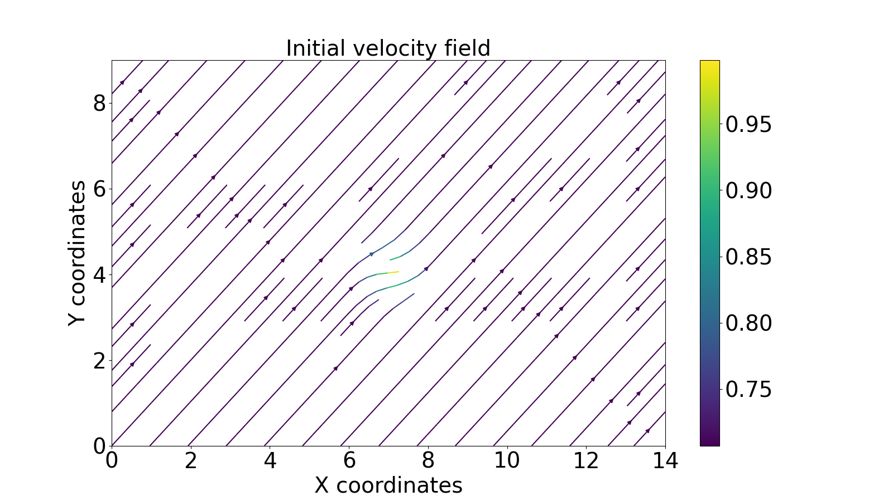

# Milestone 1: Introduction to LBE and Streaming Operator

In this milestone, there are different functions created. The most essential ones are as follows: 
1. calculate_density --->         This functions sums up all of the particles in the 9 channels for a given prob. density funct. f along axis 0, and returns the density. 
2. calculate_velocity_field  --->    This function calculates & returns the velocity field for a given prob. density funct. 
3. streaming --->     This function calculates & returns the probability density f after streaming step using np.roll
4. check_mass_conservation --->  This function calculates the sum of two different pdfs & prints out if the difference between them is bigger than difference. 

***********

HOW TO RUN THE CODE?
```
# Define the domain sizes at line 408,409
width = 15
height = 10
```
```
# Create and modify the prob. dist. function, if needed...

# initialize f: the probability density function
f_initial = initialize_pdf_zeros(width,height)

# modify f_initial
# Putting one particle to 1st channel of all nodes
f_initial[1,:,:] = 1
# Putting one particle to 2nd channel of all nodes
f_initial[2,:,:] = 1
# Putting 50 particles to 1st channel of the node at 7,4
f_initial[1,7,4] = 500
```
After changing the domain size and pdf (optional), just simply run the code. The script plots and saves the following: 
- Initial density over the domain
- Initial velocity in the x direction
- Initial streamplot
- After streaming, density over the domain
- After streaming, velocity in the x direction
- After streaming, streamplot

***********
For the case; 
- width: 15
- height: 10
- initial pdf that has a dominant number of particles at channel 1 (x direction) at x = 7, y= 4, following plots are obtained: 

Initial density:


Initial velocity in the x direction:


Initial streamplot: 




After streaming, density over the domain:


After streaming, velocity in the x direction:


After streaming, streamplot:

