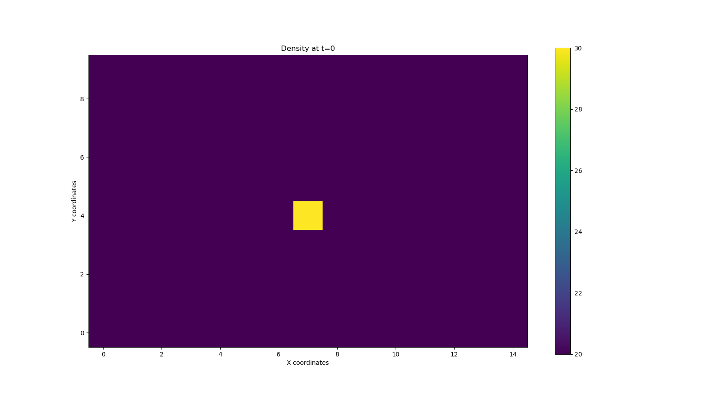
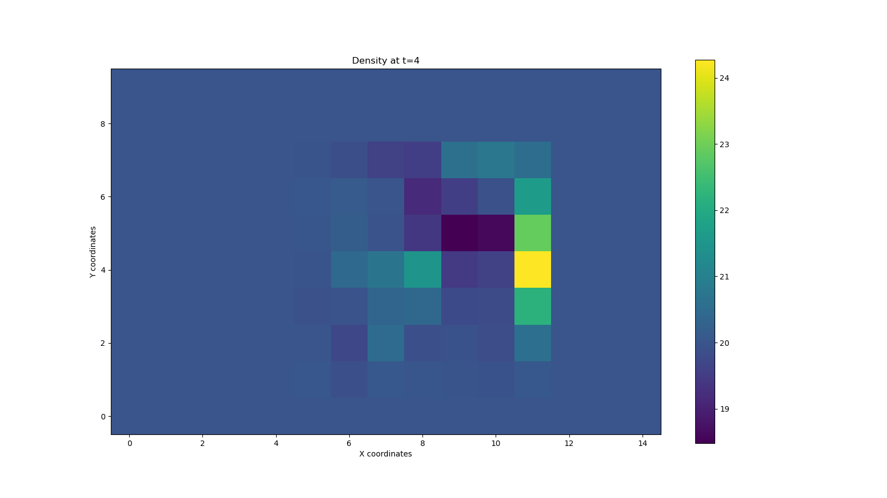
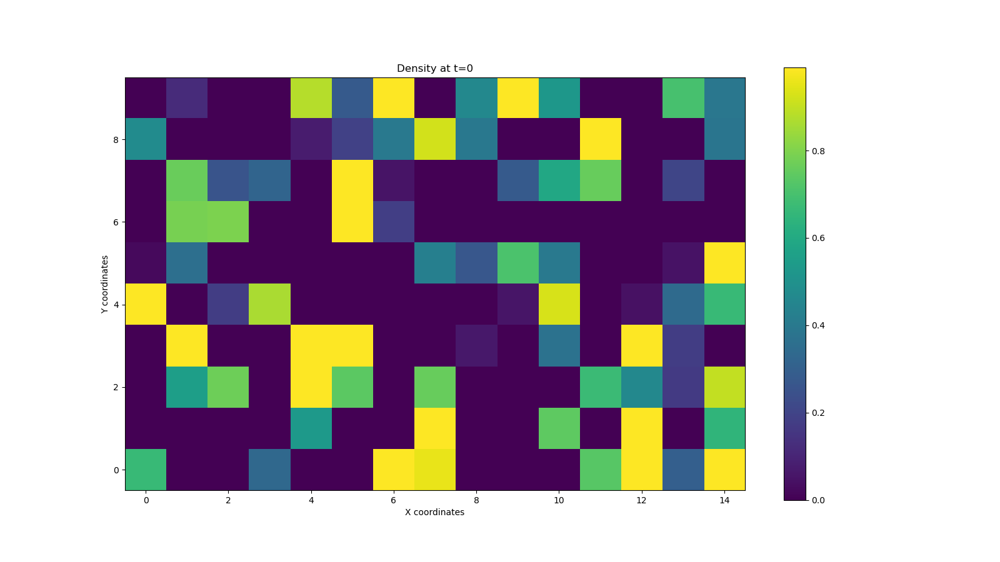
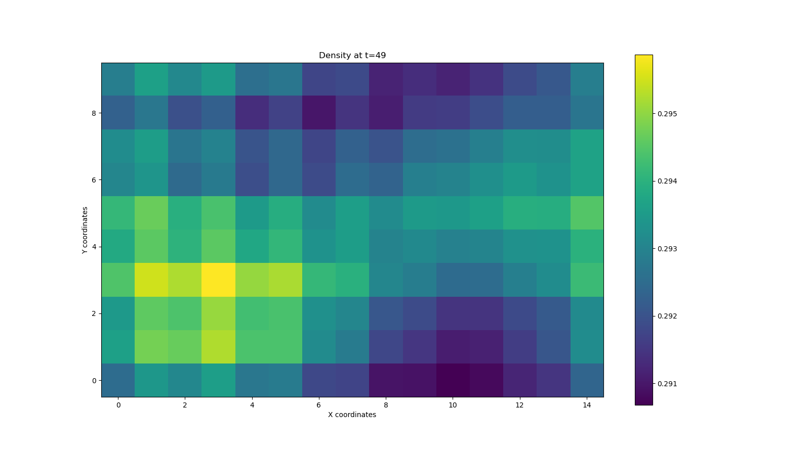

# Milestone 2: Collision Operator

In this milestone, there are different functions created. The most essential ones are as follows: 
1. calculate_f_equilibrium ---> This function returns prob. density funct. for equilibrium feq that has a size of 9 x width x height. 
2. collision  --->        This function returns prob. density funct. after collision.
3. time_iterative --->         This function iterates over time steps by performing streaming and collision for one time step.

***********

HOW TO RUN THE CODE?
```
# Define the domain sizes, relaxation parameter, time steps... 
width = 15
height = 10
w = 1
time_steps = 50
```

After changing parameters above, just simply run the code. The script asks the user which test to run, Enter 1 or 2. 

***********
**TEST 1**

The test is to create a domain that has a slightly higher density value, and observe.

Initial density:




After 5 time steps (1 time step is 1 streaming + 1 collision)



***********
**TEST 2**
The test is to choose initial distribution and observe what happens in the long run: 

Initial density:




After 50 time steps (1 time step is 1 streaming + 1 collision)



As seen, the density values for each node is likely to be same in the long run. 